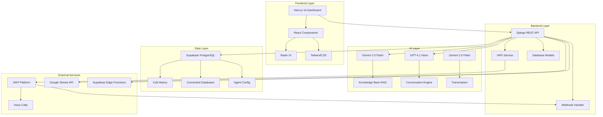

<div align="center">


<div style="background-color: #060b14; margin-top: -30px; padding: 40px 0;">
  <a href="https://git.io/typing-svg">
    
  </a>
</div>

<p align="center">
  
  
  
  
  
  
</p>
<!-- Social Links -->
<!-- Social Links -->
<p align="center">
  <a href="DEMO_LINK">
    
  </a>
  <a href="https://youtube.com/playlist?list=PLsLuXr7FW3LwKIL9K6SJDIRh2qISQKnsq&si=p_Dra1UWf91P_iyu">
    
  </a>
  <a href="https://drive.google.com/file/d/1ZVUwnB5UE8Nv0b406zvQyzalklAOD9Y8/view?usp=drivesdk">
    
  </a>
  <a href="https://modest-reflection-production-893c.up.railway.app/">
    
  </a>
</p>

<!-- Animated Divider -->


</div>

## 🌟 Overview

**LokMitra AI** is a revolutionary AI-powered voice assistant platform designed to bridge the gap between citizens and government services. Built with cutting-edge AI technologies, LokMitra enables seamless voice interactions, providing instant access to government schemes, databases, and human experts through natural language conversations.

<div align="center">

### ✨ Key Highlights

</div>

<table align="center">
  <tr>
    <td align="center" width="33%">
      
      <br />
      <b>🎙️ Voice-First Interface</b>
      <br />
      <sub>Natural multilingual conversations</sub>
    </td>
    <td align="center" width="33%">
      
      <br />
      <b>🤖 AI-Powered Intelligence</b>
      <br />
      <sub>Gemini 2.5 & GPT-4 integration</sub>
    </td>
    <td align="center" width="33%">
      
      <br />
      <b>📊 Dynamic Data Access</b>
      <br />
      <sub>Real-time database queries</sub>
    </td>
  </tr>
  <tr>
    <td align="center" width="33%">
      
      <br />
      <b>📞 Inbound/Outbound Calls</b>
      <br />
      <sub>Automated calling campaigns</sub>
    </td>
    <td align="center" width="33%">
      
      <br />
      <b>👥 Human Escalation</b>
      <br />
      <sub>Seamless expert transfers</sub>
    </td>
    <td align="center" width="33%">
      
      <br />
      <b>📚 Knowledge Base</b>
      <br />
      <sub>Document-based RAG system</sub>
    </td>
  </tr>
</table>

<div align="center">

</div>

## 🎯 Features

### 🚀 Core Capabilities

<details open>
<summary><b>🎤 Advanced Voice Interaction</b></summary>

- **Multilingual Support**: Seamless conversations in multiple Indian languages
- **Natural Language Understanding**: Powered by Gemini 2.0 Flash transcription
- **Context-Aware Responses**: Maintains conversation context throughout calls
- **Voice Customization**: Multiple voice profiles (Neha voice for Indian accent)
- **Real-time Transcription**: Live call transcripts with sentiment analysis

</details>

<details open>
<summary><b>🧠 Intelligent Agent System</b></summary>

- **Configurable AI Agents**: Customizable agent names, descriptions, and behaviors
- **Tool Management**: Enable/disable specific capabilities dynamically
- **Knowledge Base Integration**: RAG-powered document retrieval using Gemini 2.5 Flash
- **Multi-Model Architecture**: GPT-4.1 Nano for conversations, Gemini for knowledge
- **Autonomous Decision Making**: Smart tool selection and execution

</details>

<details open>
<summary><b>📊 Dynamic Database Integration</b></summary>

- **CSV/Excel Upload**: Instant database creation from spreadsheets
- **Supabase Integration**: Direct PostgreSQL database connections
- **Google Sheets Sync**: Real-time spreadsheet data access
- **Fuzzy Search**: Intelligent partial matching with RapidFuzz
- **Auto-Generated Tools**: AI creates custom query functions per database
- **Semantic Summarization**: LLM-generated database descriptions

</details>

<details open>
<summary><b>📞 Call Management</b></summary>

- **Outbound Campaigns**: Automated calling to phone lists
- **Inbound Handling**: 24/7 automated call reception
- **Call History**: Complete transcript and recording storage
- **Session Tracking**: Real-time call status monitoring
- **Webhook Integration**: End-of-call reports and analytics
- **Cost Tracking**: Per-call cost monitoring

</details>

<details open>
<summary><b>👨‍💼 Human-in-the-Loop</b></summary>

- **Expert Escalation**: Transfer calls to human specialists
- **Field-Based Routing**: Route by expertise (legal, technical, etc.)
- **Blind Transfer**: Seamless handoff to human agents
- **Configurable Triggers**: Auto-escalate on frustration/complexity
- **Expert Management**: Add/remove experts via dashboard

</details>

<details open>
<summary><b>🎨 Modern Dashboard</b></summary>

- **Next.js 16 Frontend**: Lightning-fast React-based UI
- **Radix UI Components**: Accessible, beautiful component library
- **Dark Mode**: Eye-friendly interface with theme switching
- **Real-time Updates**: Live call status and queue monitoring
- **Drag & Drop**: Intuitive file uploads and data management
- **Responsive Design**: Mobile-first, works on all devices

</details>

<div align="center">

</div>

## 🏗️ Architecture



<div align="center">

</div>

## 🛠️ Tech Stack

### Frontend
- **Framework**: Next.js 16.1.1 (React 18.3.1)
- **Language**: TypeScript 5
- **Styling**: TailwindCSS 3.4 + Tailwind Animate
- **UI Components**: Radix UI (Accordion, Dialog, Dropdown, etc.)
- **State Management**: React Context API
- **HTTP Client**: Axios 1.13.2
- **Data Parsing**: PapaParse 5.5.3
- **Charts**: Recharts 2.15.2
- **Icons**: Lucide React 0.487.0

### Backend
- **Framework**: Django 5.1.0
- **API**: Django REST Framework 3.15.2
- **Database**: PostgreSQL (via Supabase)
- **ORM**: Django ORM + psycopg2-binary 2.9.9
- **CORS**: django-cors-headers 4.4.0
- **Environment**: python-dotenv 1.0.1
- **Production Server**: Gunicorn 23.0.0
- **Static Files**: WhiteNoise 6.7.0

### AI & ML
- **LLM**: Google Gemini 2.5 Flash (langchain-google-genai 4.1.2)
- **Conversation**: OpenAI GPT-4.1 Nano (via VAPI)
- **Transcription**: Gemini 2.0 Flash / Deepgram Nova-3
- **Voice**: VAPI Voice Platform (Neha voice)
- **Search**: RapidFuzz 3.9.4 (fuzzy matching)

### Data Processing
- **Spreadsheets**: Pandas 2.2.2, OpenPyXL 3.1.5
- **Google Sheets**: gspread 6.1.2, oauth2client 4.1.3
- **Supabase**: supabase SDK 2.12.0+

### DevOps
- **Containerization**: Docker + Docker Compose
- **Version Control**: Git
- **Package Management**: npm (frontend), pip (backend)

<div align="center">

</div>

## 📦 Installation Guide

### Prerequisites

- **Node.js** 20+ and npm
- **Python** 3.12+
- **Docker** & Docker Compose (optional)
- **Git**

### 🚀 Quick Start (Local Development)

#### 1️⃣ Clone the Repository

```bash
git clone https://github.com/Kartavya728/LokMitra-AI.git
cd LokMitra-AI
```

#### 2️⃣ Backend Setup

```bash
# Navigate to backend directory
cd backend

# Create virtual environment
python -m venv venv

# Activate virtual environment
# Windows:
venv\Scripts\activate
# macOS/Linux:
source venv/bin/activate

# Install dependencies
pip install -r requirements.txt

# Create .env file
cp .env.example .env
# Edit .env with your credentials:
# - VAPI_API_KEY
# - GEMINI_API_KEY
# - SUPABASE_URL
# - SUPABASE_KEY
# - DEPLOYED_URL
# - PHONE_NUMBER_ID

# Run migrations
python manage.py migrate

# Start development server
python manage.py runserver
```

Backend will run on `http://localhost:8000`

#### 3️⃣ Frontend Setup

```bash
# Navigate to frontend directory (from project root)
cd frontend

# Install dependencies
npm install

# Create .env.local file
cp .env.example .env.local
# Edit .env.local with:
# NEXT_PUBLIC_API_URL=http://localhost:8000

# Start development server
npm run dev
```

Frontend will run on `http://localhost:3000`

### 🐳 Docker Setup (Recommended for Production)

```bash
# From project root
docker-compose up --build

# Access:
# Frontend: http://localhost:3000
# Backend: http://localhost:8000
```

### 🔧 Environment Variables

#### Backend (.env)
```env
# VAPI Configuration
VAPI_API_KEY=your_vapi_api_key
VAPI_BASE_URL=https://api.vapi.ai
PHONE_NUMBER_ID=your_phone_number_id

# AI Configuration
GEMINI_API_KEY=your_gemini_api_key

# Database (Supabase)
SUPABASE_URL=your_supabase_url
SUPABASE_KEY=your_supabase_key
SUPABASE_DB_HOST=db.xxx.supabase.co
SUPABASE_DB_NAME=postgres
SUPABASE_DB_USER=postgres
SUPABASE_DB_PASSWORD=your_db_password
SUPABASE_DB_PORT=5432

# Deployment
DEPLOYED_URL=https://your-backend-url.com
DEBUG=False
ALLOWED_HOSTS=localhost,127.0.0.1,your-domain.com
```

#### Frontend (.env.local)
```env
NEXT_PUBLIC_API_URL=http://localhost:8000
# Or for production:
# NEXT_PUBLIC_API_URL=https://your-backend-url.com
```

### 📝 Database Setup

```bash
# Run migrations
cd backend
python manage.py migrate

# Create superuser (optional)
python manage.py createsuperuser

# Load initial data (if available)
python manage.py loaddata initial_data.json
```

### ✅ Verify Installation

1. **Backend Health Check**:
   ```bash
   curl http://localhost:8000/api/get-session-status/
   ```

2. **Frontend Access**:
   Open browser to `http://localhost:3000`

3. **Test Voice Call** (requires VAPI credentials):
   - Configure agent in dashboard
   - Upload knowledge documents
   - Initiate test call

<div align="center">

</div>

## 📚 Documentation

### 📖 Comprehensive Guides

<table>
  <tr>
    <td align="center" width="50%">
      <a href="https://docs.lokmitra-ai.example.com">
        
        <br />
        <b>📘 Full Documentation</b>
      </a>
      <br />
      <sub>Complete API reference, architecture, and guides</sub>
    </td>
    <td align="center" width="50%">
      <a href="https://api-docs.lokmitra-ai.example.com">
        
        <br />
        <b>🔌 API Documentation</b>
      </a>
      <br />
      <sub>RESTful API endpoints and examples</sub>
    </td>
  </tr>
  <tr>
    <td align="center" width="50%">
      <a href="https://wiki.lokmitra-ai.example.com">
        
        <br />
        <b>📚 Wiki</b>
      </a>
      <br />
      <sub>Tutorials, FAQs, and troubleshooting</sub>
    </td>
    <td align="center" width="50%">
      <a href="https://github.com/Kartavya728/LokMitra-AI/wiki">
        
        <br />
        <b>💻 Developer Guide</b>
      </a>
      <br />
      <sub>Contributing guidelines and code standards</sub>
    </td>
  </tr>
</table>

### 🔗 Quick Links

- **[User Manual](https://docs.lokmitra-ai.example.com/user-manual)** - End-user guide
- **[Admin Guide](https://docs.lokmitra-ai.example.com/admin-guide)** - System administration
- **[Deployment Guide](https://docs.lokmitra-ai.example.com/deployment)** - Production deployment
- **[Troubleshooting](https://docs.lokmitra-ai.example.com/troubleshooting)** - Common issues and solutions

<div align="center">

</div>

## 🎥 Demo Video

<div align="center">
  <a href="https://www.youtube.com/watch?v=your-demo-video-id">
    
  </a>
  
  <br /><br />
  
  <a href="https://www.youtube.com/watch?v=your-demo-video-id">
    
  </a>
  
  <br /><br />
  
  ### 🎬 Video Highlights
  
  <table>
    <tr>
      <td align="center" width="25%">
        <br />
        <b>00:00 - 02:30</b><br />
        <sub>Introduction & Overview</sub>
      </td>
      <td align="center" width="25%">
        <br />
        <b>02:30 - 05:00</b><br />
        <sub>Dashboard Setup</sub>
      </td>
      <td align="center" width="25%">
        <br />
        <b>05:00 - 08:30</b><br />
        <sub>Live Call Demo</sub>
      </td>
      <td align="center" width="25%">
        <br />
        <b>08:30 - 12:00</b><br />
        <sub>Database Integration</sub>
      </td>
    </tr>
  </table>
</div>

<div align="center">

</div>

## 🌐 Live Website

<div align="center">
  
  ### 🚀 Experience LokMitra AI Live
  
  <a href="https://lokmitra-ai.example.com">
    
  </a>
  
  <br /><br />
  
  <table>
    <tr>
      <td align="center" width="33%">
        <a href="https://lokmitra-ai.example.com">
          
          <br />
          <b>🏠 Main Website</b>
        </a>
        <br />
        <sub>https://lokmitra-ai.example.com</sub>
      </td>
      <td align="center" width="33%">
        <a href="https://dashboard.lokmitra-ai.example.com">
          
          <br />
          <b>📊 Dashboard</b>
        </a>
        <br />
        <sub>https://dashboard.lokmitra-ai.example.com</sub>
      </td>
      <td align="center" width="33%">
        <a href="https://api.lokmitra-ai.example.com">
          
          <br />
          <b>🔌 API Endpoint</b>
        </a>
        <br />
        <sub>https://api.lokmitra-ai.example.com</sub>
      </td>
    </tr>
  </table>
  
  ### 🎮 Try It Out
  
  **Demo Credentials** (Test Environment):
  ```
  Username: demo@lokmitra.ai
  Password: Demo@123
  ```
  
  > ⚠️ **Note**: Demo environment resets every 24 hours
  
</div>

<div align="center">

</div>

## 📊 Project Structure

```
LokMitra-AI/
├── 📁 backend/                    # Django Backend
│   ├── 📁 api/                    # Main API Application
│   │   ├── 📄 models.py          # Database Models
│   │   ├── 📄 views.py           # API Views & Endpoints
│   │   ├── 📄 vapi_service.py    # VAPI Integration
│   │   ├── 📄 serializers.py     # DRF Serializers
│   │   ├── 📄 utils.py           # Utility Functions
│   │   └── 📄 structured_output.py # LLM Output Schemas
│   ├── 📁 backend/                # Django Settings
│   │   ├── 📄 settings.py        # Configuration
│   │   ├── 📄 urls.py            # URL Routing
│   │   └── 📄 wsgi.py            # WSGI Config
│   ├── 📁 history/                # Call Transcripts
│   ├── 📄 manage.py              # Django CLI
│   ├── 📄 requirements.txt       # Python Dependencies
│   ├── 📄 Dockerfile             # Backend Container
│   └── 📄 .env                   # Environment Variables
│
├── 📁 frontend/                   # Next.js Frontend
│   ├── 📁 src/
│   │   ├── 📁 app/               # Next.js App Router
│   │   │   ├── 📄 layout.tsx    # Root Layout
│   │   │   └── 📄 page.tsx      # Home Page
│   │   ├── 📁 components/        # React Components
│   │   │   ├── 📄 LoginPage.tsx
│   │   │   ├── 📄 Dashboard.tsx
│   │   │   ├── 📄 HomePage.tsx
│   │   │   ├── 📄 DatabasesPage.tsx
│   │   │   ├── 📄 HistoryPage.tsx
│   │   │   ├── 📄 KnowledgePage.tsx
│   │   │   ├── 📄 AgentConfigPage.tsx
│   │   │   └── 📁 ui/           # Radix UI Components
│   │   ├── 📁 contexts/          # React Contexts
│   │   │   └── 📄 SessionContext.tsx
│   │   ├── 📁 lib/               # Utilities
│   │   │   └── 📄 utils.ts
│   │   ├── 📁 styles/            # Global Styles
│   │   │   └── 📄 globals.css
│   │   └── 📁 types/             # TypeScript Types
│   ├── 📄 package.json           # Node Dependencies
│   ├── 📄 tsconfig.json          # TypeScript Config
│   ├── 📄 tailwind.config.ts     # Tailwind Config
│   ├── 📄 next.config.js         # Next.js Config
│   ├── 📄 Dockerfile             # Frontend Container
│   └── 📄 .env.local             # Environment Variables
│
├── 📁 Scripts/                    # Utility Scripts
│   ├── 📄 test_vapi.py           # VAPI Testing
│   └── 📄 deploy.sh              # Deployment Script
│
├── 📁 Research Data/              # Documentation & Research
│
├── 📄 docker-compose.yaml         # Docker Orchestration
├── 📄 .gitignore                 # Git Ignore Rules
├── 📄 README.md                  # This File
└── 📄 .env                       # Root Environment Variables
```

<div align="center">

</div>

## 🔌 API Endpoints

### 📞 Call Management

| Method | Endpoint | Description |
|--------|----------|-------------|
| `POST` | `/api/start-outbound-calling/` | Initiate outbound call |
| `POST` | `/api/start-inbound-agent/` | Activate inbound agent |
| `POST` | `/api/stop-calling/` | Stop active calling session |
| `GET` | `/api/get-session-status/` | Get current session status |
| `POST` | `/api/vapi-webhook/` | VAPI webhook handler |

### 📚 Knowledge Base

| Method | Endpoint | Description |
|--------|----------|-------------|
| `POST` | `/api/upload-document/` | Upload knowledge document |
| `GET` | `/api/get-documents/` | List all documents |
| `DELETE` | `/api/delete-document/<file_id>/` | Delete document |

### 🗄️ Database Management

| Method | Endpoint | Description |
|--------|----------|-------------|
| `POST` | `/api/connect-database/` | Upload CSV/Excel database |
| `POST` | `/api/connect-supabase/` | Connect Supabase database |
| `POST` | `/api/connect-google-sheet/` | Connect Google Sheet |
| `GET` | `/api/get-connected-databases/` | List all databases |
| `DELETE` | `/api/delete-database/` | Delete database |
| `POST` | `/api/execute-db-query/` | Execute database query |

### 👥 Human Experts

| Method | Endpoint | Description |
|--------|----------|-------------|
| `POST` | `/api/add-human-expert/` | Add expert for escalation |
| `GET` | `/api/get-human-experts/` | List all experts |
| `DELETE` | `/api/remove-human-expert/<id>/` | Remove expert |

### ⚙️ Agent Configuration

| Method | Endpoint | Description |
|--------|----------|-------------|
| `GET` | `/api/get-agent-config/` | Get agent configuration |
| `POST` | `/api/update-agent-config/` | Update agent settings |
| `POST` | `/api/update-tool-settings/` | Update tool enablement |

### 📊 Call History

| Method | Endpoint | Description |
|--------|----------|-------------|
| `GET` | `/api/get-call-history/` | Retrieve call history |
| `GET` | `/api/call-history/` | List call records (DRF) |

<div align="center">

</div>

## 🎨 Screenshots

<div align="center">

### 🏠 Dashboard Overview


### 📊 Database Management


### 📚 Knowledge Base


### 📞 Call History


### ⚙️ Agent Configuration


</div>

<div align="center">

</div>

## 🤝 Contributing

We welcome contributions from the community! Here's how you can help:

### 🌟 Ways to Contribute

- 🐛 **Report Bugs**: Open an issue with detailed reproduction steps
- 💡 **Suggest Features**: Share your ideas for improvements
- 📝 **Improve Documentation**: Help us make docs clearer
- 🔧 **Submit Pull Requests**: Fix bugs or add features

### 📋 Contribution Guidelines

1. **Fork the Repository**
   ```bash
   git clone https://github.com/Kartavya728/LokMitra-AI.git
   cd LokMitra-AI
   git checkout -b feature/your-feature-name
   ```

2. **Make Your Changes**
   - Follow existing code style
   - Add tests for new features
   - Update documentation

3. **Commit Your Changes**
   ```bash
   git add .
   git commit -m "feat: add amazing feature"
   ```

4. **Push and Create PR**
   ```bash
   git push origin feature/your-feature-name
   ```
   Then open a Pull Request on GitHub

### 📜 Code of Conduct

Please read our [Code of Conduct](CODE_OF_CONDUCT.md) before contributing.

<div align="center">

</div>

## 📄 License

This project is licensed under the **MIT License** - see the [LICENSE](LICENSE) file for details.

```
MIT License

Copyright (c) 2026 Kartavya728

Permission is hereby granted, free of charge, to any person obtaining a copy
of this software and associated documentation files (the "Software"), to deal
in the Software without restriction, including without limitation the rights
to use, copy, modify, merge, publish, distribute, sublicense, and/or sell
copies of the Software, and to permit persons to whom the Software is
furnished to do so, subject to the following conditions:

The above copyright notice and this permission notice shall be included in all
copies or substantial portions of the Software.

THE SOFTWARE IS PROVIDED "AS IS", WITHOUT WARRANTY OF ANY KIND, EXPRESS OR
IMPLIED, INCLUDING BUT NOT LIMITED TO THE WARRANTIES OF MERCHANTABILITY,
FITNESS FOR A PARTICULAR PURPOSE AND NONINFRINGEMENT.
```

<div align="center">

</div>

## 👨‍💻 Author

<div align="center">
  
  
  <h3>Kartavya728</h3>
  
  <p>
    <a href="https://github.com/Kartavya728">
      
    </a>
    <a href="https://linkedin.com/in/kartavya728">
      
    </a>
    <a href="https://twitter.com/kartavya728">
      
    </a>
    <a href="mailto:kartavya728@example.com">
      
    </a>
  </p>
</div>

<div align="center">

</div>

## 🙏 Acknowledgments

<div align="center">

Special thanks to the amazing technologies and services that make LokMitra AI possible:

<table>
  <tr>
    <td align="center">
      
      <br />
      <b>Google Gemini</b>
      <br />
      <sub>AI & Knowledge Base</sub>
    </td>
    <td align="center">
      
      <br />
      <b>VAPI</b>
      <br />
      <sub>Voice Platform</sub>
    </td>
    <td align="center">
      
      <br />
      <b>Supabase</b>
      <br />
      <sub>Database & Auth</sub>
    </td>
    <td align="center">
      
      <br />
      <b>Next.js</b>
      <br />
      <sub>Frontend Framework</sub>
    </td>
  </tr>
  <tr>
    <td align="center">
      
      <br />
      <b>Django</b>
      <br />
      <sub>Backend Framework</sub>
    </td>
    <td align="center">
      
      <br />
      <b>Docker</b>
      <br />
      <sub>Containerization</sub>
    </td>
    <td align="center">
      
      <br />
      <b>TypeScript</b>
      <br />
      <sub>Type Safety</sub>
    </td>
    <td align="center">
      
      <br />
      <b>TailwindCSS</b>
      <br />
      <sub>Styling</sub>
    </td>
  </tr>
</table>

</div>

<div align="center">

</div>

## 📞 Support & Contact

<div align="center">

### 💬 Get Help

<table>
  <tr>
    <td align="center" width="33%">
      <a href="https://github.com/Kartavya728/LokMitra-AI/issues">
        
        <br />
        <b>🐛 Report Issues</b>
      </a>
      <br />
      <sub>Found a bug? Let us know!</sub>
    </td>
    <td align="center" width="33%">
      <a href="https://github.com/Kartavya728/LokMitra-AI/discussions">
        
        <br />
        <b>💭 Discussions</b>
      </a>
      <br />
      <sub>Join the community chat</sub>
    </td>
    <td align="center" width="33%">
      <a href="mailto:support@lokmitra-ai.example.com">
        
        <br />
        <b>📧 Email Support</b>
      </a>
      <br />
      <sub>support@lokmitra-ai.example.com</sub>
    </td>
  </tr>
</table>

### 🌟 Star History

[](https://star-history.com/#Kartavya728/LokMitra-AI&Date)

</div>

<div align="center">

</div>

## 📈 Project Stats

<div align="center">


</div>

<div align="center">

</div>

## 🚀 Roadmap

<div align="center">

### 🎯 Upcoming Features

</div>

- [ ] 🌍 **Multi-Language Support**: Expand to 15+ Indian languages
- [ ] 📱 **Mobile App**: Native iOS & Android applications
- [ ] 🤖 **Advanced AI**: Integration with GPT-4o and Claude
- [ ] 📊 **Analytics Dashboard**: Real-time insights and metrics
- [ ] 🔐 **Enhanced Security**: End-to-end encryption for calls
- [ ] 🎨 **Custom Themes**: White-label branding options
- [ ] 📞 **SMS Integration**: Automated SMS notifications
- [ ] 🔔 **WhatsApp Bot**: WhatsApp Business API integration
- [ ] 🎯 **Smart Routing**: AI-powered call routing
- [ ] 📈 **Predictive Analytics**: Call outcome predictions
- [ ] 🌐 **Multi-Tenant**: Support for multiple organizations
- [ ] 🔄 **CRM Integration**: Salesforce, HubSpot connectors

<div align="center">

</div>

---

<div align="center">

### 💖 Made with Love for the People of India


**LokMitra AI** - *Empowering Citizens Through AI*

<br />

<sub>If you find this project helpful, please consider giving it a ⭐️</sub>

<br />

[](https://github.com/Kartavya728/LokMitra-AI/stargazers)
[](https://github.com/Kartavya728/LokMitra-AI/network/members)
[](https://github.com/Kartavya728/LokMitra-AI/watchers)

<br />

<!-- Animated Footer -->


</div>
